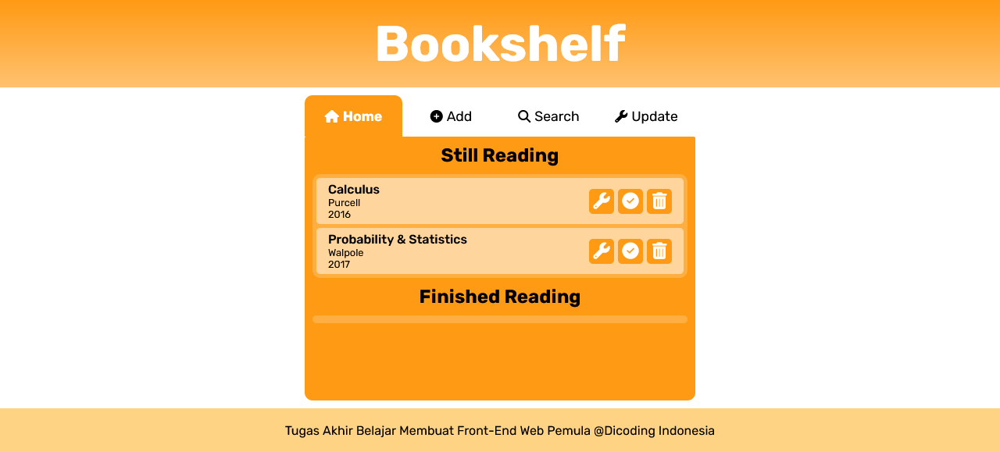

# Dicoding Academy - Final Project for 'Belajar Membuat Front-End Web untuk Pemula'

This is a submission to the 'Belajar Membuat Fornt-End Web untuk Pemula' Final Project. Dicoding Academy Final Project is a a requirement to graduate the class. 

## Table of contents

- [Overview](#overview)
  - [Screenshot](#screenshot)
  - [Links](#links)
- [My process](#my-process)
  - [Built with](#built-with)
  - [What I learned](#what-i-learned)
  - [Continued development](#continued-development)
- [Author](#author)
- [Acknowledgments](#acknowledgments)

## Overview

### Screenshot



### Links

- Solution URL: [Add solution URL here](https://your-solution-url.com)
- Live Site URL: [Add live site URL here](https://your-live-site-url.com)

## My process

### Built with

- Semantic HTML5 markup
- CSS custom properties
- Flexbox
- CSS Grid
- Mobile Responsive
- Vanilla JavaScript
- Using localStorage
- Custom JS Events

### What I learned

My largest project up until now. The code are mostly written in the main.js breaking them into 4 parts I want to mention:
- Layout Configuration
- Tab Switching Procedure
- Object (book in this case) creation
- Creating custom events

I'm thrilled after finding out this line in my code works perfectly

```js
const editStorageData = (keys, bookid, doOperationOn) => {
    for (key of keys) {
        let bookshelf = loadDataFromStorage(key)
        doOperationOn(bookshelf, bookid);
        saveData(key, bookshelf)
    }
}
```

It's quite simple but really change my perspective in writing function. I finally understand some usage of passing a function into another function.

### Continued development

This bookshelf app still have a note info part and I'm still planning to add another feature where we can see the book note inside a book info layout where the details of the book will be displayed.

## Author

- Website - [Fritz Adelbertus Sitindaon](https://www.furitsu.site)
- LinkedIn - [Fritz Adelbertus](https://www.linkedin.com/in/fritzadelbertus/)

## Acknowledgments

Thank you for Dicoding Academy for providing this project. It really challenged me to be creative and inovative.
